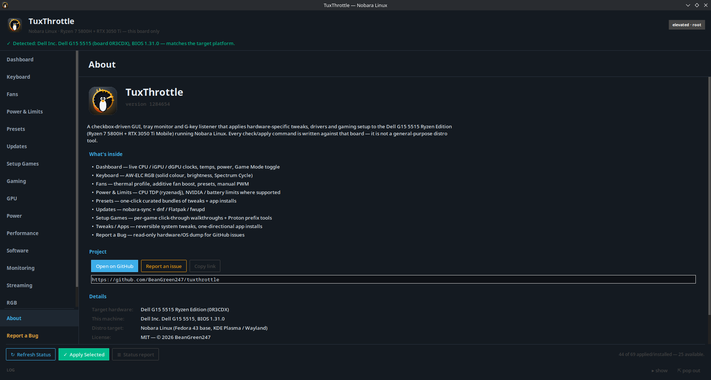

# TuxThrottle

<p align="center">
  
</p>

A checkbox-driven GUI + tray monitor for Dell gaming laptops on Nobara Linux
(dnf), built the same way as [WinUtil](https://winutil.christitus.com/)-style
Windows tweak tools: data-driven JSON config, live status detection per
item, reversible tweaks, one-directional app installs, and one-click
presets. Plus a keyboard-RGB tab, a fan/thermal tab, an updates tab, a
**Setup Games** tab with click-through per-game setup walkthroughs (GTA V
Online first), and a diagnostics tab that dumps hardware + OS info for bug
reports.

<p align="center">
  
  <br/>
  <em>TuxThrottle on the Dell G15 5515 — dark "gaming-BIOS" UI, scrollable left nav with About / Report a Bug pinned to the foot.</em>
</p>

> **Roadmap:** the goal is a general **gaming-laptop** tool. Today it targets
> exactly one machine — every check/apply command and hardware path in
> `config/*.json` is written for the Dell G15 5515 Ryzen Edition on Nobara.
> Generalising means gating each item per-model (DMI-based) and adding
> profiles for other boards; contributions and debug reports from other
> hardware are welcome (see the issue template).

**Inspired by [Div-Acer-Manager-Max](https://github.com/PXDiv/Div-Acer-Manager-Max)**
(DAMX) — the Acer NitroSense/PredatorSense replacement for Linux this was
modeled after: same idea (performance profiles, fan/thermal state, live
monitoring dashboard, one-button dedicated-key binding), rebuilt for Dell's
side of the same problem. One useful difference from DAMX's situation: Acer's
EC interface isn't in mainline Linux at all, so DAMX depends on an
out-of-tree driver (Linuwu Sense) just to get a `platform_profile`-style
interface to exist; Dell's `dell-wmi` driver is already in-tree and shows up
automatically (confirmed via `cat /proc/bus/input/devices` on the actual
laptop, showing a "Dell WMI hotkeys" entry with no extra driver installed),
so this tool doesn't need an equivalent custom kernel module — just the
right keycode mapping for the dedicated key, the same way DAMX captures its
Nitro/PredatorSense button's scancode from an actual press rather than
assuming one.

**Compatibility**: built and tested against **one confirmed platform**, the
Dell G15 5515 Ryzen Edition (Ryzen 7 5800H + RTX 3050 Ti Mobile) — that's the
hardware every check/apply command in `config/*.json` was written against.
Like DAMX's own compatibility note, other Dell/Alienware laptops with
similar AMD+NVIDIA hybrid graphics and a `dell-wmi`-exposed hotkey may work
too, but nothing here has been verified on them. The dedicated key's
capture (evdev keycode `KEY_PERFORMANCE`) was confirmed via live
`evtest`/`dmesg`/`acpi_listen` capture on the actual laptop, not assumed.

This GUI superseded an earlier bash CLI prototype with the same tweak
catalog but an interactive terminal menu instead of checkboxes/live status —
same underlying idea, this repo is the maintained one.

**Package-name check**: every `dnf` package name referenced in `config/*.json`
was cross-checked against Fedora's dist-git (`src.fedoraproject.org`) to
confirm it actually exists before being trusted — this caught one real
error: `ttkbootstrap` is **not** packaged in Fedora/Nobara at all (404 on
dist-git), `pip install --user ttkbootstrap` is the only install path,
fixed in `tuxthrottle.py`'s own error message. `akmod-nvidia` lives in
RPM Fusion's separate dist-git (unreachable from this check, but its name
is standard/well-documented) rather than Fedora's own.

**Status: running on the real laptop.** The keyboard RGB (whole-keyboard
colour + firmware Spectrum Cycle), the Fans tab, the Updates tab,
the sidebar UI and the tweak status checks have all been exercised on the
actual Dell G15 5515 on Nobara. A few tweaks that need a reboot to fully
verify (kernel-cmdline ones) are still best-effort — see "Known limitations".

## Tested hardware

Every check/apply command in `config/*.json`, the sensor probes in
`sensors.py`, and the dedicated-key capture were written against the single
machine below, and **the toolkit is developed and tested on it live** — running
Nobara Linux, `sudo ./install.sh`, the GUI, `tuxthrottlectl`, the daemon and
its control socket, and the module self-tests (`verify-install.sh`: 27 passed).
The original evdev/dmesg/acpi values were pulled from a Linux live USB before
the Nobara install; everything since is verified on the installed system.

| Component | What's in the test machine | Identifiers / notes |
|---|---|---|
| **Laptop** | Dell G15 5515, Ryzen Edition | SMBIOS `Dell G15 5515`, board `0R3CDX` |
| **BIOS** | Dell `1.31.0` | dated 2026-01-28; Secure Boot disabled during testing |
| **CPU** | AMD Ryzen 7 5800H (Cezanne, Zen 3) | family 19h model 50h stepping 0; 8 cores / 16 threads; `k10temp` |
| **iGPU** | AMD Radeon Graphics (Cezanne, Vega 8) | PCI `1002:1638`, driver `amdgpu`; hybrid via ATPX / `vga_switcheroo` |
| **dGPU** | NVIDIA GeForce RTX 3050 Ti Mobile (GA107), 4 GB | PCI `10de:25a0`, HDA `10de:2291`, VBIOS `94.07.2b.00.60`; captured under `nouveau` (GSP RM 570.144), NVIDIA proprietary is the toolkit's target |
| **RAM** | ~40 GB DDR4 | both SO-DIMM slots populated (2/2) |
| **Storage** | 2× NVMe SSD (ADATA) | PCI `1cc1:33f3` (`nvme0`, 4 partitions) + `1cc1:64ba` (`nvme1`) |
| **Ethernet** | Realtek RTL8125B 2.5 GbE | PCI `10ec:8125`, driver `r8169` |
| **Wi-Fi / BT** | Intel Wi-Fi 6 AX200 (Killer AX1650x, 200NGW) | PCI `8086:2723`, driver `iwlwifi` |
| **Audio** | Realtek ALC3254 codec + AMD/NVIDIA HDMI audio | `snd_hda_codec_alc269` (ALC3254 fixup) |
| **Touchpad** | Dell / ELAN I2C | `DELL0A6E:00 04F3:317E` (mouse + touchpad nodes) |
| **Keyboard** | AT Translated Set 2 | dedicated G-key → `KEY_PERFORMANCE` (701) with Fn Lock **off**, `KEY_F9` with Fn Lock **on** |
| **Vendor hotkeys** | in-tree `dell-wmi` (no extra driver) | "Dell WMI hotkeys" + "DELL Wireless hotkeys" input devices |
| **Capture OS** | Linux `7.0.0-14-generic` live USB | used only for the initial evdev/dmesg/acpi captures |
| **Running OS** | Nobara Linux (Fedora 43 base, `dnf`, KDE Plasma 6 / Wayland) | **installed and tested on the real hardware** — `install.sh`, GUI, CLI, daemon + control socket, `verify-install.sh` all green |

Firmware notes seen at boot: `WQBC` WMI data-block and `_S0W`
`AE_ALREADY_EXISTS` ACPI warnings — both harmless on this board.

Other Dell/Alienware models with an AMD + NVIDIA hybrid setup and a
`dell-wmi`-exposed hotkey may work, but nothing here has been verified on
them.

## Install (system-wide, adds it to the KDE menu)

```bash
cd tuxthrottle
sudo ./install.sh
```

*(An RPM / COPR path also exists — see `packaging/` — for a `dnf install`
instead of the git clone. The tweaks stay opt-in either way; they are never
applied from `%post`.)*

Installs to `/opt/tuxthrottle`, a launcher at
`/usr/local/bin/tuxthrottle`, the Tux throttle-gauge icon into the hicolor
theme, and a `.desktop` entry in `/usr/share/applications` — so **every user**
on the machine can find "TuxThrottle" in the KDE launcher / KRunner
search. It pulls the deps too (`python3-tkinter`, `ttkbootstrap` via pip
system-wide, and — best effort — `python3-pyside6` and `python3-evdev`).

**Uninstalling:**

- `sudo ./install.sh --uninstall` — removes just the app (`/opt`, launcher,
  icon, menu entry).
- `sudo ./uninstall.sh` — the same, plus your per-user toolkit config; tweaks
  and services are **kept** (they work without the GUI).
- `sudo ./uninstall.sh --purge` — also undoes every tweak's system bits
  (RGB/hotkey/CPU-perf services, helper scripts, the passwordless-sudo rule,
  drop-ins). Add `--grub` / `--fstab` / `--pip` (or `--all`) for the
  boot-affecting extras. Apps it installed (Steam, Lutris, …) are never
  touched.

## Running it from the source tree

```bash
cd tuxthrottle
pip install --user ttkbootstrap   # one-time; dark theme + round-toggle switches + gauges
python3 tuxthrottle.py
```

It self-elevates via `pkexec` (falls back to `sudo`) since tweaks touch the
kernel cmdline, udev rules, sysctl, and `dnf`. The `--user` pip install lands
in your home dir, which root normally can't see after elevation — the script
carries that path through on `PYTHONPATH` when it re-execs, so the `--user`
install is enough. (A system-wide `sudo pip install --break-system-packages
ttkbootstrap` also works if you prefer.)

## Layout

The window is a **left sidebar nav** (gaming-BIOS style, ASUS/Acer-ish),
re-skinned from ttkbootstrap `darkly` into a near-black palette that picks up
your **KDE accent colour** automatically (with a WCAG contrast fallback if
your accent would be unreadable on the dark panels). Pages: Dashboard,
Keyboard, Fans, Presets, Updates, then one page per tweak/app category
(Gaming first). Long operations (Apply Selected, presets, updates) put up a
modal overlay with an **overall** progress bar, a **current-task** bar
(showing "downloading / installing / …" parsed from the live output) and an
elapsed timer.

## The Dashboard tab

A live "system info" view like DAMX's monitoring dashboard. Eight ring
gauges in a 2×4 grid — **CPU** temp / clock / power, **iGPU** clock,
**dGPU** temp / clock / util / power — plus iGPU/dGPU details as text and a
big round-toggle for Game Mode (same effect as the G-key or the tray icon).
All of it shares one source of truth (`sensors.py`). The dGPU reads skip
`nvidia-smi` while the card is runtime-suspended so polling doesn't wake it.

## The Fans tab

DAMX's fan-control equivalent for this board:

- **Thermal profile** — `balanced` / `performance` / `custom`
  (`/sys/firmware/acpi/platform_profile`, same lever Game Mode uses).
  Optional **"Tie keyboard colour to the active profile"** toggle (off by
  default) — Quiet=blue / Balanced=white / Performance=red, the same
  LED-per-profile convention LenovoLegionLinux/Legion-Linux-Toolkit use;
  a free physical status indicator since the keyboard is single-zone
  anyway. Currently covers this tab's profile switch and its presets, not
  yet a named-profile apply from the Profiles tab.
- **Per-fan boost** — sliders (0–100 % → `alienware_wmi/fanN_boost` 0–255) for
  the CPU and GPU fans, with live RPM readouts. Boost only *adds* airflow on
  top of the firmware curve, so it can't stall a fan.
- **Presets** — Auto/silent, Cooler, Max cooling.
- **Manual PWM** (advanced, behind a warning) — takes the EC off its curve via
  `dell_smm` `pwmN`, floored so the fans never fully stop, with a "Restore
  automatic" button.
- **Custom fan curve** (closed-loop) — a 10-point temperature → boost table
  with a live curve preview, driven from CPU / GPU / hotter-of-both, with a
  cool-down hysteresis, **Silent / Balanced / Aggressive** presets and a
  **Linear fill** button (place the two endpoints, it interpolates the rest).
  A background daemon (`tuxthrottle_powerd.py`,
  enabled by the **Fan-curve + AC-switch daemon** tweak) applies it and
  restores automatic control when stopped. It only ever *adds* boost. Old
  5-point configs load and are resampled to 10 on open.

The profile + boost sliders don't persist a reboot on their own; the fan
curve and TDP limits do, via their tweaks' systemd units.

## The Power & Limits tab

The knobs that shape the power/thermal envelope — the Linux answer to
ThrottleStop / the ASUS Armoury sliders:

- **CPU power limits (ryzenadj)** — STAPM / fast / slow sliders (Watts) with
  Quiet / Balanced / Performance presets and a live "now" readout. On the
  5800H the SMU floors STAPM near the slow limit, so presets keep STAPM ≥ slow.
- **Curve Optimizer (all-core undervolt)** — a `ryzenadj --set-coall` offset
  slider (0 … −40) with an **"Apply & stress-test (5 min)"** button. It
  snapshots, applies the offset, then hammers the CPU (+ a GPU load) for five
  minutes while watching `dmesg` for MCE/WHEA and auto-reverts on any fault.
  The offset is **not** kept across a reboot until you press **Keep (confirm)**;
  the **RyzenCurveOptimizer** tweak's boot service only re-applies a *confirmed*
  offset, so a bad value that hung the box before you confirmed it doesn't come
  back. Genuinely risky — a too-aggressive undervolt can still hard-hang the
  machine (recoverable only by a full power-off). Hidden on non-AMD CPUs.
- **NVIDIA board power limit** — a slider where the GPU allows it; on the
  G15 5515's RTX 3050 Ti Mobile the limit is firmware-locked (Dynamic Boost),
  so the section shows that instead of a dead control.
- **NVIDIA GPU clock lock** — clamp the dGPU graphics clock
  (`nvidia-smi --lock-gpu-clocks`), which works even when `-pl` is
  firmware-locked. Lower the ceiling for heat / battery; presets and an
  "Unlock / reset". State in `nvclk.json`, re-applied at boot/resume by the
  **NVIDIA GPU clock-lock persistence** tweak. Hidden while the dGPU is asleep.
- **Hybrid graphics mode** — integrated / hybrid / nvidia via EnvyControl,
  with a log-out-to-apply warning (hidden until EnvyControl is installed).
- **Battery charge limit** — a stop-charging percentage via the kernel
  `charge_control_end_threshold` where present, or Dell firmware (libsmbios)
  via the **Dell battery threshold** tweak on machines like the 5515 that
  lack the sysfs attribute.
- **AC / battery auto-switch** — pick a bundle (profile + TDP preset), and
  optionally a refresh rate, to apply automatically when the charger is
  plugged or pulled; handled by the same `tuxthrottle_powerd.py` daemon.
- **Thermal-event alerts** — with the daemon running, sustained Tjmax, a
  stalled fan while hot, or Performance-on-low-battery raise a desktop
  notification plus a `journalctl -u tuxthrottle-powerd` line (config block
  `thermal_notify` in `powerd.json`; off by default).

State is written to `~/.config/tuxthrottle/{tdp,nvpl,nvclk,battery,co,powerd}.json`
and re-applied at boot by the matching tweaks' units. When the daemon is up it
also exposes a **root-only control socket** at `/run/tuxthrottle/control.sock`
so the GUI and `tuxthrottlectl` route hardware writes through the one process
that owns the hardware (they fall back to writing directly when it's not).

## The Display tab

Panel-tuning controls in one place, instead of scattered across other tabs
(the LenovoLegionLinux/Legion-Linux-Toolkit "Display" tab was the model):

- **Panel refresh rate** — switch the internal panel between its rates (the
  5515 is 144 Hz; 60 Hz on battery is a real power saving). Resolution is
  kept; KScreen remembers the choice. KDE / kscreen-doctor only. The AC/
  battery auto-switch on the Power & Limits tab can flip this with the
  charger.
- **Adaptive Sync (VRR)** — reports which displays are VRR-capable; enable
  per-display in System Settings, pair with the KDE "allow tearing" tweak
  for lowest latency. Informational only — VRR itself is a KDE display
  setting, not something TuxThrottle writes.

No screen-brightness slider here on purpose — KDE's own brightness control
(tray/OSD) already owns that; duplicating it would just fight the desktop's
own state.

## The Battery tab

Battery **wear** (how much of the pack's original design capacity is gone),
charge **cycle count**, chemistry, and a live card with charge, power flow,
**time-to-empty / time-to-full at the current rate**, and voltage — all
straight from the kernel `power_supply` sysfs, so it works on any laptop. The
charge-limit control from Power & Limits is repeated here so the longevity
knobs sit on one page.

## The Profiles tab

A **profile** is a named snapshot of the *whole* power surface — thermal
profile, CPU TDP, battery limit, NVIDIA power limit, NVIDIA GPU clock lock,
panel refresh rate, fan curve, AC/battery auto-switch, keyboard colour.
Capture the current state as a named profile, apply one with a click, or roll
back.

- **Automatic snapshots** — applying a profile, rolling back, or hitting
  "Apply Selected"/a preset/a recommended-set on the tweaks first drops a
  timestamped config snapshot in `~/.config/tuxthrottle/snapshots/` (newest
  20 kept), so there is always a known-good state to return to if something
  misbehaves. On a Btrfs root with `snapper` configured, the same moment
  also takes a real filesystem-level snapshot (see "Safety net" below) —
  the config snapshot undoes TuxThrottle's own settings, the Btrfs one lets
  you undo anything else the change touched.
- **Confirm-or-auto-revert watchdog** — applying any tweak tagged ADVANCED
  arms an independent countdown (systemd timer, not a thread in the GUI):
  confirm within the window or it rolls back to the pre-apply snapshot on
  its own, even if the change froze the GUI or the whole session. See
  "Safety net" below.
- **Per-game auto-profiles** — map an executable name (for Proton games, the
  Windows `.exe`) to a profile; the `tuxthrottle_powerd.py` daemon snapshots
  and applies it while the game runs, and restores it on exit. `*` matches
  any Feral GameMode session.
- **Time schedule** — apply a preset (Quiet / Balanced / Performance) or a
  saved profile by time of day, e.g. Quiet 22:00–07:00. Rules may wrap past
  midnight and carry a weekday mask (all days by default); a running per-game
  profile wins. Config block `schedule` in `powerd.json`; toggle from the CLI
  with `tuxthrottlectl schedule {show|on|off}`.
- **Export / import** — a saved profile is already a plain, hardware-agnostic
  JSON (semantic units, no raw hwmon paths), so "Export…" on any profile just
  writes it to a file you pick, tagged so import can validate it; "Import
  profile…" reads one back (rejecting anything that isn't a real TuxThrottle
  export). Trade known-good curves/TDP loadouts with other G15 owners the way
  the CachyOS community trades configs.
- **CLI** — `tuxthrottlectl profile list|apply|save|export|import`,
  `tuxthrottlectl snapshot`, `tuxthrottlectl rollback [last]`.
- **Suspend/resume** — the **StateResume** tweak re-applies the last applied
  state after a wake or reboot (TDP/battery/NVIDIA limits set directly don't
  always survive on their own).

## Safety net (Btrfs snapshots + auto-revert watchdog)

Two mechanisms layered on top of the config-snapshot system above, aimed
squarely at the class of failure that can't just be undone by reapplying a
JSON state — a kernel/boot-config change gone wrong, or a live change that
locks the machine up before you get to click anything:

- **Btrfs filesystem snapshot before a risky batch** (`tuxthrottle_btrfs.py`)
  — if `/` is Btrfs and `snapper` is configured (config `root`), every
  "Apply Selected" / preset / recommended-set run also takes a read-only
  `snapper` snapshot, tagged `tuxthrottle: <label>`, before touching
  anything. This module only *creates* snapshots — it never touches the
  bootloader or the default subvolume itself; the log line after a risky
  apply prints the exact `snapper rollback <N>` command to run (then
  reboot) if you ever need it. On any other filesystem, or without
  `snapper`, it's a silent no-op — nothing else about the apply flow
  changes. CLI: `tuxthrottlectl btrfs-snapshot {available|create [desc]|list}`.
- **Confirm-or-auto-revert watchdog** (`tuxthrottle_watchdog.py`) — the
  pattern Windows/NVIDIA display-settings dialogs use: whenever a batch
  includes an ADVANCED-tagged tweak, a transient systemd timer is armed
  alongside a Keep / Revert Now countdown dialog. Click Keep and it's
  cancelled; click Revert Now and it rolls back immediately; do nothing and
  it reverts to the pre-apply snapshot on its own when the timer runs out.
  Because the timer is an independent systemd unit (not a thread inside the
  GUI process), it still fires the rollback even if the change itself
  freezes the GUI or the desktop session — the exact failure mode a purely
  in-app confirmation dialog can't survive. CLI:
  `tuxthrottlectl watchdog {arm SECONDS --user NAME|disarm UNIT|status UNIT}`.

## Desktop tweaks (KDE Plasma 6)

The **KDE (Desktop GUI Tweaks)** category — reversible Plasma toggles,
mirrored from a typical "gaming Kubuntu" setup. Each runs `kwriteconfig6`
as your user (with your session D-Bus) and then reloads the live component
(`qdbus-qt6`/`dbus-send` → KWin `reconfigure`, or a `plasmashell` restart),
so the change sticks instead of being flushed back on logout. Undo removes
the keys so Plasma returns to its defaults.

| Tweak | Effect |
|---|---|
| Disable window animations + eye-candy | `AnimationDurationFactor=0` + KWin blur/wobbly/slide/fade/… effects off — instant windows, zero compositor overhead |
| KWin compositor tuned for games | OpenGL/GLCore, fullscreen unredirect (`WindowsBlockCompositing`), `LatencyPolicy=Low`, bilinear texture filter |
| Classic Application Menu | the old Win-95-style hierarchical start menu (`kicker`) instead of Kickoff |
| Show seconds on the panel clock | `showSeconds=2` on every digital-clock widget |
| Panel flush to the screen edge | turns off the Plasma 6 **Floating panel** — sets `floating=false` in appletsrc *and* `floating=0` in `plasmashellrc [PlasmaViews][Panel N]` (the one that actually removes the gap) so the bottom panel stays pinned to the edge instead of lifting a few mm away when no window is maximised |
| Disable the Meta (Super / Win) key launcher | a lone tap of the Meta key no longer opens the launcher (`[ModifierOnlyShortcuts] Meta=""`); Meta+key combos still work — fixes "the Win key drops me out of a fullscreen game" |
| Disable all screen-edge actions | no hot-corner Overview/Grid triggers mid-game |
| Stop Activities + recent-docs tracking | kills the `kactivitymanagerd` journal + file-open history |
| Limit Dolphin thumbnail I/O | cap thumbnail size, no remote-folder thumbnails |
| No launch feedback | no bouncing cursor / taskbar button on app start |
| Disable the Plasma splash screen | desktop appears as soon as it's ready |
| Disable KWallet | stops the login wallet-unlock prompt + KWallet GPG/SSH passphrase caching |
| Allow screen tearing | `AllowTearing=true` for lowest-latency fullscreen (pair with a VRR panel) |

## The Updates tab

Wraps Nobara's own updater plus the other package managers on the box:

- **Everything** — "Check everything" and "Update everything (system +
  Flatpak)" with a reboot prompt.
- **System — dnf / nobara-sync** — check, update, apply known fixups, repair
  (distro-sync), `dnf upgrade --refresh`, clean cache, and **Fix Fedora GPG
  keys** (the `.fc44` / Fedora-44-key gotcha).
- **Flatpak** and **Firmware (fwupd)** sections when those tools are present.

Output streams live to the log console; a failure pops a scrollable detail
dialog. A pending-update counter (`dnf --cacheonly` + flatpak + fwupd) shows
at the top with a "recount" button, tagged with the age of the dnf metadata
on disk (`dnf list as of 2 h ago`) — a full `dnf check-update` can take
minutes on this box's mirrors, so the figure is a snapshot that self-corrects
after any Check/Update.

## The Setup Games tab

Click-through setup walkthroughs for games that need more than "install and
run" on Linux. A top tab-strip has one page per game (**GTA V Online**
first); each page is an ordered list of step cards:

- A status pill per step — **done ✓** / **to do** (a `check` command decides)
  / **manual** / **optional**.
- Steps with a **▶ Run step** button do the work for you and stream output to
  the log console (same busy-overlay + failure dialog as the Updates tab):
  install Steam + the gaming layers, pull the latest **GE-Proton** straight
  from GitHub into `compatibilitytools.d`, trigger the **Proton BattlEye
  Runtime**, raise `vm.max_map_count`, apply the Wi-Fi/latency tweaks.
- **Manual** steps (things that can't be scripted while Steam is running —
  enabling Steam Play, forcing GE-Proton on the title, launch options) show
  the exact clicks, a **⧉ Copy command** button where useful, and a
  "Mark done" toggle.
- **▶▶ Run all N automatic steps** at the top of a game's page chains every
  Run-step in order, skipping ones already done.

The GTA V flow mirrors "GTA V Online → Route A" further down this README.
Data lives in `config/games.json` — add a game by adding a key with an
ordered `steps` list (`check` / `run` / `manual` / `copy`; `{USER}`,
`{TOOLKIT_DIR}`, `{APPID}` are substituted).

> **GTA V Online note:** the walkthrough gets you a working prefix and
> **Story Mode**. GTA *Online* (Enhanced, Steam AppID 3240220) is **not**
> playable on Linux — Rockstar does not allow-list Proton for its BattlEye,
> so you connect to a session and get kicked. No Proton/prefix change fixes
> a server-side block.

## The Game Tools tab

Steam / Proton helpers that apply to *any* game, split out of Setup Games so
that tab is just the walkthroughs.

A **Proton prefix tools** box: **Scan Steam prefixes** lists every
`compatdata/<appid>` prefix and
flags ones on an NTFS/exFAT drive (Proton can't build a prefix there —
`dosdevices/c:` needs a `:` in the name, which those filesystems reject, so
the game won't launch); type an **AppID** + **Relocate this prefix** moves
just that prefix onto the Linux drive and symlinks it back (game files stay
put; close Steam first). A second row of buttons handles **save files that
ended up on another drive**: it finds prefix folders (Documents / Saved
Games / AppData) symlinked onto a different filesystem, and loose
`Documents` / `My Games` folders sitting at a Steam drive's root (left
behind when a prefix used to redirect there). It pulls the symlinked ones
back into the prefix automatically; for the loose folders you give it the
game's AppID and it copies them in. Nothing is deleted — the off-drive
copies stay put until you've confirmed the saves work. Backed by
`tuxthrottle_prefix_relocate.py` (`--scan` / `--all` / `--saves-scan` /
`--saves` / `--saves-all` / `--saves-import`), also usable standalone.

A **save-game vault** row does bulk backup/restore: point it at a folder on
a **separate drive** (not the OS/Steam drive — enforced), then **Export
saves → vault** copies `Documents` / `Saved Games` / `AppData\Roaming` /
`AppData\LocalLow` out of the prefix into `<vault>/<appid>/…`, and **Import
saves ← vault** copies them back. Blank AppID field = every prefix at once;
**List vault** shows what's stored. Backed by `tuxthrottle_savevault.py`
(`list` / `export` / `import`); the vault path is remembered in
`~/.config/tuxthrottle/saves_vault`.

A **Shader / pipeline cache storage** box picks one folder (any drive) for
every generated shader cache — Mesa (AMD), DXVK, the NVIDIA driver, and
optionally **Steam's own** `steamapps/shadercache` (moved in + symlinked back,
close Steam first). The choice is saved to
`~/.config/tuxthrottle/shadercache.json` (`dir` + `max_size_gb`, default 80 GB
— the cap applies to the Mesa and NVIDIA caches, which self-prune; DXVK and
Steam's own cache have no size knob). The box shows **three live sizes** —
total, Steam's cache, and the rest (Mesa + DXVK + NVIDIA) — with a **↻
Refresh** button; **Save location** and **Apply shader cache size** are
separate buttons, and **Clean cache** is there but optional (the caches
rebuild on next launch). **Force-rebuild Steam's shader cache** goes further
for Steam specifically — it deletes Steam's own fossilize cache
(`steamapps/shadercache`) so Steam regenerates it from scratch on the next
launch (useful after a driver update or a corrupt-cache stutter; the Mesa /
DXVK / NVIDIA caches are left alone; close Steam first). A **Steam background Vulkan shader
processing** Off / On pair unticks (or re-ticks) Steam → *Settings →
Downloads → "Allow background processing of Vulkan shaders"* — turning it off
stops the `fossilize_replay` background compiles that peg the CPU after every
download; it edits `config.vdf` (backed up first), so close Steam and restart
it afterwards. A **Check links** button (auto-runs when you open the
tab) verifies every Steam library's `steamapps/shadercache` symlink still
points at this folder — a link left **dangling** (e.g. after moving the cache
folder) makes Steam fail every download / verify with **"disk write error"**;
if it reports broken, **Link Steam's shader cache here** now *repairs* it in
place. Moving the folder also re-points the existing links automatically. The
launch-options builder and the `NvidiaShaderCache` tweak both read this
location; changing it doesn't rewrite launch options already pasted into a game
— regenerate and re-paste those. All the `du` / directory work runs off the UI
thread so a big or cold cache drive never freezes the window.

A **Steam client — low-resource mode** box makes the Steam *client* (not
games) as light as possible: **Enable** writes a user-level launcher override
(`~/.local/share/applications/steam.desktop`, which shadows the system one,
and patches the autostart entry) that starts Steam with `-silent`
(straight to the tray) plus the safe CEF flags — `-cef-disable-gpu`,
`-cef-disable-gpu-compositing`, `-cef-disable-breakpad`,
`-cef-disable-extra-info-spew` — which stop Steam's embedded Chromium UI (its
main source of idle CPU / RAM / VRAM) from GPU-compositing the
store/library/friends views, and `-noverifyfiles` / `-nobootstrapupdate` /
`-norepairfiles`, which skip the file-scan, self-update and repair passes Steam
runs on every launch (it still re-verifies on demand if it finds corruption). The patched launcher also
runs Steam in a `systemd` scope with a **soft** memory limit
(`systemd-run --user --scope -p MemoryHigh=1200M`): above ~1.2 GB the kernel
just reclaims cache harder so Chromium sheds its own caches — nothing is ever
killed. And it flips **every low-resource setting Steam keeps in a file** (each
`userdata/*/config/localconfig.vdf` + `config/config.vdf`; needs Steam closed —
re-run Enable with Steam shut if it says so): no auto Friends & Chat sign-in
(*SignIntoFriends = 0* — that renderer alone is a few hundred MB), no friends
animations, and background Vulkan-shader processing off (the Steam Overlay and
screenshots are left on). A few more toggles live in Steam's own internal
store and can't be scripted — **Enable prints them in the log**: Library → *Low
Bandwidth Mode* + *Low Performance Mode*, Interface → smooth scrolling off,
Downloads → Shader Pre-Caching off. **Disable** removes the override, restores
autostart, and flips the localconfig keys back (it leaves the background-shader
setting alone — that has its own toggle).

It uses only the levers that don't break the client: `-cef-single-process`,
`-no-cef-sandbox`, `-no-browser` and a hard `MemoryMax` are deliberately *not*
used — those gave a blank/broken client or OOM-killed Steam. (They were briefly
offered as an opt-in **Aggressive** tier; on 2026-09-03 that tier was confirmed
to crash-loop `steamwebhelper` — SIGTRAP in libcef roughly every 10 s, no
usable client — on a current Steam build, and was removed. `--aggressive` on
the CLI is now a no-op.) This only affects Steam **launched from the
application menu or autostart** — a Steam that's
already running, or one started from a pinned taskbar icon (KDE caches that
launcher's own command), keeps the old behaviour, so **fully quit Steam and
relaunch it from the menu** after enabling. Trade-off: you sign into chat
manually (the Steam Overlay and screenshots keep working).

One extra toggle in the box: **Autostart Steam hidden on login** (default on)
— if you have no Steam autostart entry, Enable creates one carrying `-silent`
so Steam comes up on login straight to the tray with no window; Disable removes
it. If Steam ever looks broken after Enable, first check your Steam-library
drive is actually mounted — an unmounted library looks identical (no games) —
then run `tuxthrottle_steamperf.py off` in a terminal.

A **launch-options builder** ticks together a Steam/Lutris launch-options
string: MangoHud, Feral GameMode, gamescope (+ resolution/fps cap), NVIDIA
PRIME offload, **persistent NVIDIA / Mesa / DXVK shader caches** (into the
folder above, so they survive a prefix wipe/relocate), NVIDIA threaded
optimizations (`__GL_THREADED_OPTIMIZATIONS` — **off by default; it crashes a
fair number of Wine/Proton and legacy-OpenGL games at startup**),
`RADV_PERFTEST=gpl` (AMD), an AMD vsync-off + threaded-GL toggle, `DXVK_ASYNC`
(off by default — trades a little visual stutter risk for smoother shader
compiles), Proton log off, and an **Anti-cheat safe** toggle (`MANGOHUD=0
DISABLE_VKBASALT=1 VK_LOADER_LAYERS_DISABLE=~implicit~` — a clean Vulkan layer
stack for BattlEye / EAC titles; also drops the `mangohud` wrapper). Produces a
`[env] [wrappers] %command%` string with a **⧉ Copy** button, and a note: if a
game won't launch, clear the options and add them back a few at a time.

A **MangoHud overlay** box sets the overlay's names, detail and position. It
shows **one CPU-name field and one GPU-name field per GPU in the machine**
(detected via `nvidia-smi` / `lspci`), each labelled with that GPU's **PCI
address** so two identical cards are still distinguishable; **↻ Detect**
refills them from the hardware. The first GPU name becomes MangoHud's
`gpu_text`; a second field turns on `gpu_list 0,1` so MangoHud prints each
card's own stats. **Place on screen…** opens a translucent **full-screen picker
at your real resolution** — drag the "MangoHud" box to where you want it,
release to drop. It snaps to a **16×16 grid** by default (uncheck *snap to
grid* for pixel-precise), and the result is stored as the nearest of MangoHud's
8 anchors plus an `offset_x` / `offset_y` to hit the exact spot; buttons for
**Save position** (writes just `position` / `offset_*`), **Restore last
saved**, **Restore default**, **Cancel** (Esc). Three **"Show in full"**
toggles set the detail per group: off = that group shows only its load %
(`cpu_stats` / `gpu_stats` / `ram`), on = it adds temp + power (+ VRAM for
memory). Separate **"Also show"** switches add the **frametime graph** (its
own hard on/off, not tied to the group toggles) and **GPU core / mem clock**.
FPS, the graphics-API line and each GPU's real name (`gpu_name` — confirms
which card PRIME offload landed on) always stay. On Write the whole stat
section is rewritten to exactly that set — everything else (per-process memory,
wine/arch/io lines, …) is stripped. A **Per-game** field (the game's
exe/binary name) targets `~/.config/MangoHud/<name>.conf` instead of the global
one. Every write **rewrites the file cleanly** — each key appears once (latest
value wins), leading comments kept, blank lines / malformed lines / junk
dropped — and pins `width` to a value sized to your longest CPU/GPU name and
the detail level (a bit narrower when every group is minimal, since the value
column is just "42 %" instead of "65.5 W"). MangoHud's own auto-width doesn't
grow for a long custom label, so it would otherwise clip; re-hit Write after
changing a name or a toggle. **Reset config** rebuilds
the file from scratch — styling + keybind + the current toggles/names/position,
old file kept as `.bak`. Writes are **atomic** (temp file + rename) so
MangoHud's live config watcher never sees a half-written file. If you enabled
MangoHud globally via a `LD_PRELOAD=…libMangoHud.so` line in
`~/.config/environment.d/` (older versions of the *MangoHud Global On/Off*
tweak did this), that forces the overlay into KWin and Plasma themselves, and
editing the config here would crash the desktop — the app now detects that
line and offers to remove it (leaving `MANGOHUD=1`, which is all games need);
log out and back in afterwards.

A **Last game session** card shows the daemon's post-game summary (max temps,
avg clocks, throttle %).

## The Bug Report tab

One button collects a read-only **hardware + OS + toolkit-state report** for
bug reports: OS/kernel/cmdline, DMI identity, CPU/GPU, thermal + fan state,
the keyboard / hotkey / **media-key** evdev map (`/proc/bus/input/devices`
with the KEY-capability bitmaps, plus which event device the G-key and volume
keys sit on), OpenRGB device list, package versions, and filtered
`dmesg` / `journalctl` errors — the same kind of dump used to bring the G-key
up in the first place. Buttons: **Copy report**, **Save to file…**, and
**Copy GitHub issue template** (pre-filled sections to paste on the tracker).
**Collect hardware bundle (.tar.gz)** does more: it writes a folder of *raw*
dumps plus **`model-scaffold.json`** — an auto-generated starting point for
`models/<slug>.json` (probed fields filled, the rest left under `_todo`). The
raw dumps: full DMI + `dmidecode`, `lscpu` + `ryzenadj -i`, `lspci -vvv`,
`lsusb -v`, `/proc/bus/input/devices` plus a **decoded per-device
KEY-capability list** (every Fn / media / vendor key each evdev device can
emit, no live `evtest` needed), the whole `/sys/class/hwmon` tree,
`platform_profile` + powercap + `lm_sensors`, the `power_supply` tree +
`upower` + `smbios-battery-ctl` (battery method), `smbios-token-ctl` (Dell
firmware tokens), vendor `/sys/devices/platform` WMI interfaces +
`/sys/class/leds` + module params, `fwupdmgr get-devices`, DRM/GPU +
`nvidia-smi -q` + `glxinfo`/`vulkaninfo`, display modes (`kscreen-doctor`,
`xrandr`), `openrgb -l --verbose`, a **base64 of the ACPI DSDT** (decompile
with `iasl -d` for vendor-WMI reverse engineering), and dmesg/journal — then
tars it with a README that spells out the next steps. Run it with **sudo** so
`dmidecode`, the DSDT and the SMBIOS tokens are readable. Attach the `.tar.gz`
to a **New hardware support** issue.

Terminal equivalents:

```bash
sudo python3 /opt/tuxthrottle/tuxthrottle.py --debug        # full readable report
sudo python3 /opt/tuxthrottle/tuxthrottle.py --report       # apply-status table only
sudo python3 /opt/tuxthrottle/tuxthrottle.py --collect ~    # write the hardware bundle
```

## `tuxthrottlectl` — headless control

A stdlib CLI over `sensors.py` for scripts, keybinds and `ssh` sessions
(installed to `/usr/local/bin/tuxthrottlectl`):

```bash
tuxthrottlectl status --json                   # everything, machine-readable
tuxthrottlectl watch 2                          # live one-line summary, refresh every 2 s
tuxthrottlectl get clocks                       # cpu/igpu/dgpu MHz
tuxthrottlectl get tdp                          # current ryzenadj limits
sudo tuxthrottlectl set power-profile performance
sudo tuxthrottlectl set tdp balanced           # or --stapm 42 --fast 54 --slow 42
sudo tuxthrottlectl set fan-boost both 60
sudo tuxthrottlectl set refresh 60             # panel Hz (KDE / kscreen-doctor)
sudo tuxthrottlectl set gpu-clock 1500          # lock the dGPU graphics clock (--min N); "reset" to unlock
sudo tuxthrottlectl gamemode toggle
tuxthrottlectl schedule show                    # the time-of-day schedule (schedule on|off to toggle)
sudo tuxthrottlectl profile apply "quiet night"
tuxthrottlectl daemon status                    # the tuxthrottled control socket
```

`set` commands need root and exit non-zero on failure. When the
**Fan-curve + AC-switch daemon** is running, `set` and `profile apply` are
routed through its `/run/tuxthrottle/control.sock` so one process owns the
hardware; otherwise they act directly.

## Hardware-aware gating

Items tagged `requires_vendor: "nvidia"` or `"amd"` in the JSON (the NVIDIA
driver, EnvyControl, CoreCtrl, the GPU perf-state scripts) are automatically
greyed out and labeled "unsupported" if that GPU vendor isn't detected on
the running system — the same "dynamic UI hides unsupported features"
principle DAMX uses, done via one detection pass (`sensors.has_nvidia_gpu()`
/ `has_amd_gpu()`) at startup rather than a hardcoded per-model table.

Sections that can't work on the running hardware degrade to an explanatory
note instead of a dead control: the NVIDIA power-limit slider (firmware-locked
on the 5515), the battery section (points you at the libsmbios tweak), the
hybrid-graphics radios (until EnvyControl is installed), the Curve Optimizer
section (hidden on non-AMD CPUs). The **RaplPowerPermissions** tweak is hidden
entirely on a box where the RAPL counters are already world-readable
(Nobara 43's default) and it would be a no-op.

**Per-board gate.** `models/<slug>.json` holds one hardware profile per
supported laptop, matched on DMI (`sensors.model_profile()` — falls back to
`g15-5515`, the reference board). A tweak or app entry can carry
`"models": ["g15-5515", "..."]` to only appear on those boards; an entry with
no `models` key applies everywhere, which is every entry today. See
`models/README.md` for adding a second machine.

## Files

- `tuxthrottle.py` — the checkbox GUI + in-window Dashboard tab (needs `ttkbootstrap`)
- `tray_monitor.py` — the system-tray-only equivalent (needs `PySide6`)
- `hotkey_listener.py` — the G-key → Game Mode binding (needs `python3-evdev`)
- `sensors.py` — shared sensor reads + Game Mode logic + CPU TDP (ryzenadj), battery, NVIDIA/hybrid-GPU helpers, **no GUI dependency**, used by everything below so they never disagree on state
- `tuxthrottle_profiles.py` — stdlib: capture / apply / snapshot / rollback of named full-state profiles; used by the Profiles tab, the CLI, the daemon and the `StateResume` tweak
- `tuxthrottle_btrfs.py` — stdlib: Btrfs/snapper filesystem snapshot-before-apply (create-only, never touches the bootloader); see "Safety net"
- `tuxthrottle_watchdog.py` — stdlib: confirm-or-auto-revert systemd-timer watchdog for ADVANCED-tagged tweaks; see "Safety net"
- `tuxthrottle_powerd.py` — stdlib daemon: closed-loop fan curve + AC/battery auto-switch (profile + TDP + panel refresh) + per-game auto-profiles + **time-of-day schedule** + **thermal-event alerts** + the **control socket** (installed by the **Fan-curve + AC-switch daemon** tweak)
- `tuxthrottle_control.py` — stdlib: the newline-JSON RPC over `/run/tuxthrottle/control.sock` (server in the daemon, client in the GUI / `tuxthrottlectl`)
- `tuxthrottle_co_stress.py` — stdlib, root: Ryzen Curve Optimizer undervolt with a stress-test-and-auto-revert harness (`apply` / `confirm` / `revert` / `reapply` / `status`)
- `tuxthrottle_kde_panel.py` — stdlib helper for the panel-applet KDE tweaks (clock seconds, classic menu, panel-flush) — finds applet / panel containment IDs and restarts `plasmashell`
- `tuxthrottlectl.py` — headless CLI over `sensors.py` + profiles (`status` / `get` / `set {power-profile,tdp,fan-boost,battery,nvpl,gpumode,refresh,gpu-clock}` / `profile` / `snapshot` / `rollback` / `gamemode` / `schedule` / `daemon` / `btrfs-snapshot` / `watchdog`, `--json`), installed as `/usr/local/bin/tuxthrottlectl`
- `models/` — per-board hardware profiles keyed by DMI (`g15-5515.json` is the reference); `sensors.model_profile()` picks one, and a tweak/app can gate itself with `"models": [ ... ]`
- `clients/` — optional panel front-ends: a **waybar** module and a **KDE plasmoid**, both over `tuxthrottlectl status --json`
- `packaging/` — the noarch RPM `.spec` + `.github/workflows/copr.yml` (SRPM on tag → COPR)
- `tests/` — `pytest` suite for the pure logic (parsers, fan-curve maths, profile engine, control socket, thermal watcher, model profiles); `.github/workflows/ci.yml` runs it on push
- `tuxthrottle_kbd.py` — AW-ELC RGB keyboard control: a thin `openrgb` CLI
  wrapper for whole-keyboard solid colour, brightness and the firmware
  Spectrum Cycle (the 5515 keyboard is a single controllable zone)
- `install.sh` / `uninstall.sh` — system install; uninstall removes the app
  (`uninstall.sh --purge` also undoes the tweaks' system bits)
- `assets/` — `icon.svg` (Tux in a redlined throttle gauge with an amber boost
  flame) and the
  PNGs rendered from it, used as the window icon and tray icon. The
  **DesktopLauncher** tweak drops a `.desktop` entry into your app menu
  using `assets/tuxthrottle.desktop` with real paths filled in.

## Tray monitor (`tray_monitor.py`)

The DAMX-style live dashboard piece — a system tray icon (unprivileged
process) showing CPU/iGPU/dGPU clocks and temps, with a checkable "Game Mode"
menu item (also toggled by left-clicking the tray icon) that runs the
`gaming-performance`/`amdgpu-perf-high`/`nvidia-max-perf` helper scripts
installed by the tweaks above — install those first (Presets > Safe Baseline
or Competitive Gaming) or the toggle has nothing to call. The context menu
also has **Power profile** (Balanced / Performance) and **Fan boost**
(0 / 50 / 100 %) submenus, routed through `pkexec tuxthrottlectl` (the
**PolkitTuxthrottlectl** tweak makes that passwordless for an active local
user) or the daemon socket.

```bash
# needs PySide6: dnf install python3-pyside6   (or: pip install --user PySide6)
python3 tray_monitor.py
```

The toggle tries passwordless `sudo` first, falling back to a `pkexec` GUI
prompt (see `PasswordlessGameModeToggle` below for making that prompt-free).
Reading clocks/temps needs no privileges at all. Every toggle (tray, G-key,
or the Dashboard switch) also raises a 10-second desktop notification —
*Game Mode: ON* / *Game Mode: OFF*.

## Keyboard tab (`tuxthrottle_kbd.py`)

The 5515's RGB keyboard is the Alienware **AW-ELC** (USB `187c:0550`) — no
kernel driver, no `kbd_backlight` LED, and raw HID writes (feature *and*
interrupt reports) are ACK'd but do nothing. What **does** work, verified on
real hardware, is **OpenRGB** driving it, so `tuxthrottle_kbd.py` is a thin
wrapper around the `openrgb` CLI.

Two prerequisites:
- **OpenRGB installed** (the `OpenRGB` app, Software tab).
- **Backlight enabled in BIOS setup** (F2 → *Keyboard Backlight*). If the
  keys stay dark this is why — the firmware drives the backlight at POST and
  won't hand a *disabled* one to the OS.

**The 5515 keyboard is a single controllable zone.** OpenRGB advertises 4/16
zones, but every zone-scoped write path (CLI `-z`, the SDK per-LED buffer, a
raw HID per-zone animation) lands on the whole keyboard — camera-verified. So
there is no per-zone colour and no travelling gradient. The Keyboard tab gives
a brightness slider, whole-keyboard colour + presets, a **Spectrum Cycle**
button and a **↻ Reset backlight** button (see "quirks" below).

**Spectrum Cycle** is the controller's own *firmware* effect: the whole board
sweeps the hue wheel, smoothly and fast, timed by the MCU (uniform — no
left-to-right travel). It is the only firmware effect that animates on fw
1.1.12 (Breathing / Flashing just hold a colour; Rainbow Wave is washed-out).

```bash
python3 tuxthrottle_kbd.py on --color 00aaff --brightness 80
python3 tuxthrottle_kbd.py effect spectrum --speed 80   # firmware Spectrum Cycle
python3 tuxthrottle_kbd.py off
```

**Quirks (learned the hard way):**

- **Brightness is inverted.** Every mode reports a degenerate range; `-b 100`
  is what actually lights the backlight, `-b 0` turns it off.
- **Persistence** is opt-in: the **KbdBacklightFix** tweak (Power tab) installs
  an OpenRGB SDK-server service + a boot/resume `apply-saved` that re-applies
  `~/.config/tuxthrottle/kbd.json`. The state file resolves the invoking
  user via `PKEXEC_UID`/`SUDO_UID` (pkexec sets no `PKEXEC_USER`) so the GUI's
  saves land in your home dir, not `/root`.
- **"Frozen" backlight** = the OpenRGB SDK server wedged after many changes;
  the **↻ Reset backlight** button (or `tuxthrottle_kbd.py reset`) restarts it and
  re-applies the saved state.

### Dedicated key binding — confirmed working

Unlike DAMX's Acer button (which needs a udev hwdb remap), the G15 5515's
G-key sends a clean, purpose-built keycode — `KEY_PERFORMANCE` (701) on the
"AT Translated Set 2 keyboard" — captured live. What *produces* it depends
on Fn Lock:

| | bare tap of the key | Fn + F9 |
|---|---|---|
| **Fn Lock OFF** | `KEY_PERFORMANCE` | `KEY_F9` |
| **Fn Lock ON** | `KEY_F9` (plain F9) | `KEY_PERFORMANCE` |

`hotkey_listener.py` only ever acts on `KEY_PERFORMANCE`, so it can never
hijack a real F9 press.

**What the key does — same as Windows.** On the G15 the dedicated key
toggles **G-Mode**: on Windows that's Alienware Command Center flipping the
firmware thermal profile to its top setting (fans ramp, CPU/GPU power limits
raised) and back. On this hardware Linux exposes that same firmware toggle
as the `performance` **platform_profile** (driver `alienware-wmi`) — the
kernel's own docs note *"if the device supports G-Mode, it is also toggled
when selecting the performance profile."* So one press → `performance`
(G-Mode on), press again → `balanced` (off). The `gaming-performance` /
`gaming-balanced` scripts do exactly that, and additionally slam the
`alienware-wmi` fan boost (`fanN_boost` → max / back to 0) for the AWCC-style
100 % fan on top of the profile's own ramp. It also tints the **Left
keyboard zone red** while G-Mode is active (like AWCC's red G-key), if
OpenRGB is installed and the backlight is on.

Default trigger is **one press** (matches Windows). `KEY_PERFORMANCE` fires
as an instant down+up so a long-press can't be used; if a bare tap is too
easy to hit by accident, set `TUXTHROTTLE_HOTKEY_MODE=double` on the service for
a double-tap trigger (window = `TUXTHROTTLE_HOTKEY_DOUBLE_MS`, default 600 ms).

Install via the Toolkit GUI (Gaming tab):
- **HotkeyListener** — installs `python3-evdev` and a `systemd --user`
  service that listens for the key and calls the same toggle the tray icon
  uses. Install `PowerProfileScripts` / `AmdgpuPerfScripts` / `NvidiaMaxPerf`
  first, or the toggle has nothing to call. Reading the keyboard device
  needs `input`-group membership, which Nobara 43 KDE does **not** grant the
  desktop user by default — the tweak runs `usermod -aG input`, so **log out
  and back in once** after applying it before the service can see the key.
- **PasswordlessGameModeToggle** — a narrow `/etc/sudoers.d` rule scoped to
  exactly the five toggle scripts (not general root access), so pressing the
  key doesn't sit waiting on an unanswerable GUI password prompt. Optional,
  but effectively required for the hotkey path specifically — skip it and
  the tray icon still works fine (its `pkexec` prompt has someone there to
  answer it).

## What's in it

Every tweak/app category page has an **★ Apply section recommendations**
button on the right of its title — it applies the developer's curated picks
for *that* section (snapshot taken first, kernel-cmdline items flagged for a
reboot), and only appears when something's still unapplied. It's on the far
side of the header so it can't be fat-fingered instead of a nav click.
Recommended-by-default: `CstateFix` (Stability); the safe Performance set +
the curated kernel cmdline; `PowerProfileScripts` / `RyzenAdjTDP` /
`FanCurveDaemon` / `StateResume` / `GameModeBridge` / `KbdBacklightFix`
(Power); `NvidiaDriver` / `nvidia-max-perf` (GPU); all 10 **KDE (Desktop GUI
Tweaks)**. `RyzenCurveOptimizer` is *not* recommended-by-default — it's opt-in
and stress-tested on demand.

- **Presets tab** — Safe Baseline, Competitive Gaming, Streaming Rig,
  **Maximum Performance (aggressive)**: one button applies a curated bundle.
  *Maximum Performance* piles on the spicy stuff — `mitigations=off` +
  PCIe/NVMe-latency + iGPU-PowerPlay kernel args, bounded-writeback VM sysctls,
  forced CPU performance governor, NVIDIA max-PowerMizer / PAT / ReBAR module
  options, RADV GPL + glthread + low-render-ahead GPU env, KWin tearing/low
  latency, quiet GameMode tuning, ananicy-cpp, masked idle services. **No
  fan/thermal changes** — fans stay on the stock auto curve (the dGPU just
  runs warmer on its own), and it does *not* bundle `IrqThreadsRt` (RT IRQ
  scheduling — advanced/experiment only) or `SchedExtGaming` (the scx_lavd
  scheduler, which hard-freezes this kernel). Several entries need a reboot;
  every one is individually reversible. Plus **★ Apply all recommendations** — applies every item the
  developer marked `recommended` across all categories in one pass and offers
  to enable the background daemon (snapshot first).
- **Stability** — the C-state freeze fix (and the alternative `idle=nomwait`),
  `clocksource=tsc`, **NtfsForceMount** (adds `force` to every `ntfs3`
  `/etc/fstab` line + `ntfsfix -d` so a drive Windows left "dirty" — Fast
  Startup / hibernation — still mounts instead of vanishing on boot),
  **KernelVerboseBoot** (drop `quiet splash`, add `loglevel=7` / `printk.time`
  / `systemd.show_status` — the full scrolling boot log; display-only, no
  extra disk writes).
- **GPU** — NVIDIA driver check/install, EnvyControl (AMD+NVIDIA hybrid
  switching), CoreCtrl, ryzenadj, amdgpu/nvidia perf-state scripts,
  **NvidiaPowerLimit** (persist `nvidia-smi -pl` where the GPU allows it).
- **Power** — TLP or auto-cpufreq (pick one), `gaming-performance`/
  `gaming-balanced` toggle scripts, i8kutils fan control (DAMX's fan-tab
  equivalent — best-effort, `dell-smm-hwmon` isn't confirmed to whitelist
  this model), **RaplPowerPermissions** (see "Power reporting" below;
  auto-hidden where it's already a no-op), and the Power & Limits stack:
  **RyzenAdjTDP** (STAPM/fast/slow limits + boot/resume re-apply),
  **RyzenCurveOptimizer** (all-core undervolt with a stress-test/auto-revert
  harness; only re-applies a *confirmed* offset at boot),
  **BatteryChargeLimit** / **DellBatteryThreshold** (libsmbios) for a
  stop-charging percentage, **FanCurveDaemon** (`tuxthrottle_powerd.py` —
  closed-loop fan curve + AC/battery profile auto-switch + per-game
  auto-profiles + thermal-event alerts + the control socket), **StateResume**
  (re-apply the last profile after suspend/reboot), **GameModeBridge** (wires
  Feral gamemode's start/end hooks to the toggle scripts).
- **KDE (Desktop GUI Tweaks)** — 14 reversible Plasma-6 toggles (see the
  "Desktop tweaks" section): animations off, KWin gaming compositor, classic
  Application Menu, clock seconds, panel flush to the screen edge, screen edges
  off, activities/recent-docs off, thumbnail I/O limit, launch feedback off,
  splash off, KWallet off, Meta-key off, KWin tearing, **KdeAutoShowBattery**
  (pin the Battery & Brightness tray icon to Always-shown) and
  **KdeLauncherPowerButtons** (restore Sleep / Restart / Shut Down in the app
  launcher when it drops to just Log Out).
- **Performance** — USB autosuspend off, flat mouse accel, swappiness, zram
  tuning, KDE Baloo indexer off. Plus a curated **kernel-cmdline** set
  (`split_lock_detect=off`, `nowatchdog`, `preempt=full`, `threadirqs`, … —
  reboot required; the Intel-only / laptop-dangerous entries from typical
  desktop lists are deliberately left out), and an opt-in **aggressive** set
  on top — `KernelUltraCmdline` (`mitigations=off` + PCIe/NVMe-latency + iGPU
  PowerPlay), `VmWritebackSysctl`, `NvidiaAggressiveModule` (PAT / ReBAR /
  forced max PowerMizer — runs the dGPU hotter), `GpuGamingEnv` (RADV GPL +
  glthread + low render-ahead), `ServiceMaskGaming`, `AnanicyCpp`,
  `GameModeQuietIni`, and `IrqThreadsRt` (RT priority on GPU/NVMe IRQ threads
  — **risky, not in any preset**). Optional `ipv6.disable=1`,
  **CpuMaxPerformance** (pin the `performance` governor at boot),
  **BtrfsNoatime**, **NvmeIoTune**, **WifiPowersaveOff**,
  **NetLatencySysctl** (BBR + fq + TCP Fast Open), **DnfSpeed** (parallel
  downloads + fastestmirror), **GamingResourceLimits** (nofile / map-count /
  inotify for Wine + Proton), **AutoMountDrives** (permanent `/etc/fstab`
  entries mounting every fixed internal data partition — a second games/data
  NVMe, NTFS via `ntfs3` included — at a stable `/mnt/<label>` with `nofail`;
  skips OS/boot/swap/fstab/LUKS/removable).
- **Software / Monitoring / Streaming / RGB / Gaming** — Steam, Lutris,
  Heroic, GameMode/MangoHud, gamescope, vkBasalt, btop/nvtop/GOverlay/
  fastfetch, Discord/OBS/Sunshine/Moonlight, OpenRGB, controller udev rules,
  the G-key hotkey listener + its passwordless-sudo rule,
  **MangoHudGlobalToggle** (see "Global MangoHud" below). For Wine/Proton:
  **ProtonUp-Qt**, **Protontricks**, **Bottles**, and the Steam **Proton
  BattlEye / EasyAntiCheat Runtime** installers — see "GTA V Online" below.
- **Keyboard backlight** — `tuxthrottle_kbd.py` + the Keyboard tab, 4-zone
  colour/brightness via OpenRGB (needs the `OpenRGB` app **and** the
  backlight enabled in BIOS setup). See "Keyboard tab" above.
- **Game Mode notifications** — pressing the G-key (or toggling from the
  tray/Dashboard) raises a 10-second desktop notification, *Game Mode: ON*
  / *Game Mode: OFF*.

## Global MangoHud (works on any game, not just per-title launch options)

The normal MangoHud workflow is pasting `mangohud %command%` into every
single Steam game's launch options one at a time. The `MangoHudGlobalToggle`
tweak installs `mangohud-global-on`/`mangohud-global-off` instead — they
write/remove `~/.config/environment.d/mangohud.conf` containing:

```
MANGOHUD=1
LD_PRELOAD=/usr/$LIB/mangohud/libMangoHud.so
```

`MANGOHUD=1` alone is enough for Vulkan games — the Vulkan loader has a
built-in "enable this implicit layer only if this env var is set" mechanism
that MangoHud's own layer manifest uses, so no per-game opt-in needed. The
`LD_PRELOAD` line (using the dynamic linker's own `$LIB` token, resolved by
`ld.so` at process-launch time — deliberately NOT shell-expanded when this
file is written) additionally catches the rare pure-OpenGL title Vulkan's
mechanism wouldn't reach.

**This is systemd `environment.d`, not a live shell variable** — it applies
to processes launched by your graphical session going forward, which takes
effect after your next login (or at minimum, restarting Steam so it and
everything it launches picks up the new session environment). Once active,
MangoHud's own in-game keybind (`Shift_R+F12` by default) shows/hides the
overlay display without touching this global on/off state — that's the
"pause the HUD for one round" control; `mangohud-global-off` is the "stop
hooking every process" control.

## Power reporting — a real permissions gotcha

Both the Dashboard tab and the tray icon read CPU package power from Linux's
RAPL energy counters (`/sys/class/powercap/*/energy_uj`, delta-measured over
a short window since RAPL only exposes cumulative energy, not instantaneous
watts). **Since 2020, the kernel locks these to root-only by default** as a
side-channel mitigation — since the tray icon and hotkey listener
deliberately run unprivileged (only the Game Mode toggle itself elevates),
CPU power reads as blank/zero for them out of the box. The `RaplPowerPermissions`
tweak adds a udev rule (`chmod -R a+r /sys/class/powercap`) — the same fix
MangoHud's own documentation recommends for its power display — making
these readable by any local user. Trade-off: this is a known, low-severity
timing side-channel exposure, not "safe" by risk tag, since it affects
every user of the machine, not just this tool. GPU power (NVIDIA via
`nvidia-smi`, no permission issue there) and all clock/temp reads need no
such fix — they're readable unprivileged by default.

Both the Dashboard and the tray icon show a warning inline when this isn't
fixed, rather than silently displaying wrong/blank numbers.

## GTA V Online (Wine / Proton)

GTA Online runs on Linux, but it's driven by **BattlEye** anti-cheat, so the
prefix has to carry the BattlEye runtime. There are two supported routes; the
toolkit's Software tab installs the tooling for both (`ProtonUp-Qt`,
`Protontricks`, `Bottles`, `Steam: Proton BattlEye Runtime`,
`Steam: Proton EasyAntiCheat Runtime`, plus `Lutris`, `MangoHud`, `GameMode`,
`vkBasalt`).

### Route A — Steam copy + Proton (most reliable)

1. Software tab: install **Steam**, **GameMode + MangoHud**, **ProtonUp-Qt**,
   **Steam: Proton BattlEye Runtime**.
2. In ProtonUp-Qt: install the latest **GE-Proton** for Steam.
3. Steam → GTA V → Properties → Compatibility → force **GE-Proton**.
4. Steam → Library → Tools → make sure **Proton BattlEye Runtime** is
   installed (the toolkit tries to trigger this; do it by hand if the entry
   isn't there).
5. Launch options:
   ```
   __NV_PRIME_RENDER_OFFLOAD=1 __VK_LAYER_NV_optimus=NVIDIA_only __GLX_VENDOR_LIBRARY_NAME=nvidia MANGOHUD=0 DISABLE_VKBASALT=1 VK_LOADER_LAYERS_DISABLE=~implicit~ DXVK_ASYNC=1 gamemoderun %command%
   ```
   `MANGOHUD=0` + `DISABLE_VKBASALT=1` + `VK_LOADER_LAYERS_DISABLE=~implicit~`
   turn off every injected Vulkan implicit layer (overlay / post-fx) — a clean
   layer stack is what keeps BattlEye happy; `gamemoderun` is a plain wrapper
   so it stays. The three `__…OFFLOAD` / `optimus` / `GLX` vars render on the
   NVIDIA dGPU (drop them if you're in nvidia-only graphics mode). `DXVK_ASYNC=1`
   cuts shader stutter. BattlEye installs itself into the prefix on first launch
   — let it finish, then start again.
6. If the Rockstar/Social Club window is black: switch GE-Proton version, or
   add `PROTON_USE_WINED3D=0`; if sign-in loops, set the prefix to Windows 10
   (`protontricks <appid> --gui` → *win10*).

### Route B — Rockstar Games Launcher (non-Steam copy)

Use **Lutris** (simplest) or **Bottles**:

- **Lutris:** add game → search *"Rockstar Games Launcher"* → install the
  community script. It pulls a wine-GE runner + DXVK automatically. In the
  game's *Runner options* enable **BattlEye**. If RGL won't open, set the
  runner to a current **wine-ge** / **GE-Proton** build and Windows version
  to 10.
- **Bottles:** new bottle (type *Gaming*) → Dependencies: `dxvk`,
  `vcrun2019`, `d3dcompiler_47`, `corefonts` → run the RGL installer inside
  it → add GTA V's `PlayGTAV.exe` as a program. Turn off the Rockstar
  overlay (it crashes under Wine).

Common to both: keep the machine on **Game Mode** (G-key / tray) while
playing, and apply the **WifiPowersaveOff** + **NetLatencySysctl** tweaks —
GTA Online is sensitive to Wi-Fi latency spikes.

### GTA Trilogy — Definitive Edition (III / Vice City / San Andreas)

Each has its own **Setup Games** tab (`config/games.json` entries `GTA3DE`
/ `GTAVCDE` / `GTASADE` — Steam AppIDs **1546970 / 1546990 / 1547000**).
All three boot through the **Rockstar Games Launcher** (like GTA V
Enhanced), so the walkthrough mirrors GTA V Online's Route A: native Steam
+ tools, latest **GE-Proton** forced on the title, the Proton prefix kept
**off NTFS/exFAT** (`tuxthrottle_prefix_relocate.py`), and — only if the
launcher / Social Club sign-in loops or renders black — `vcrun2019` /
`d3dcompiler_47` / `corefonts` dropped into the prefix via `protontricks`
plus a flip to **Windows 10** (`protontricks <appid> --gui` → *win10*).
They are single-player (no BattlEye), so the clean-Vulkan-layer launch
string isn't required — the launch options are a plain
`gamemoderun mangohud %command%` with PRIME offload for the hybrid G15,
and there's no BattlEye-runtime or `vm.max_map_count` step.

## How status/apply works

Every item has a `check` shell command. On launch (and **Refresh Status**),
each runs and the checkbox **pre-ticks** with an **Applied** / **Installed**
tag if true — this isn't guesswork, it reflects the actual system state, and
it detects things installed outside this tool too (Nobara pre-ships Steam,
GameMode, MangoHud, gamescope, the NVIDIA driver, … — those show up as
already done). The status bar shows a running count: *"N of M already
applied/installed — K available."*

A kernel-cmdline tweak that's been staged in the bootloader but needs a
reboot to be live gets a third state, **Pending reboot** (via an optional
`check_pending` command) — pre-ticked, and skipped by Apply, so you don't
re-select and re-run it in the window between applying and rebooting.

**Telling what really happened.** The check command is authoritative for the
*current* state, but the tool also keeps an **apply ledger**
(`~/.config/tuxthrottle/state.json`) of what it applied/undid and how it
went. Combined, an item reads as one of: **Applied / Not applied / Pending
reboot / Check error** (the check couldn't even run) / **Reverted** (the tool
applied it but the check now fails — something undid it) / **Apply failed**
(the tool's last attempt errored). The footer's **≣ Status report** button
(or `python3 tuxthrottle.py --report` on the terminal, run with `sudo`
for checks that need root) prints a full copyable table: every item, its
state, the exact check command + exit code, and the toolkit's last action on
it with a timestamp.

**Apply Selected** is a diff, not a blind re-run:
- Tweak checked + not applied → applies it.
- Tweak checked + already applied / pending reboot → **skipped** (logged).
- Tweak unchecked + currently applied → reverts it (if it has an `undo`).
- App checked + not installed → installs it (apps don't auto-uninstall on
  uncheck, same as the Windows tool's Software tab).

The log pane at the bottom streams every command's output live, and prints
how many already-done items it skipped.

## Extending it

Same as the Windows tool: add an entry to `config/tweaks.json` or
`config/apps.json`, no code changes needed. Schema:

```jsonc
"SomeId": {
  "Content": "Display name",
  "Description": "...",
  "category": "Performance",     // becomes a tab
  "risk": "safe" | "advanced",
  "check": "shell command, exit 0 = applied/installed",
  "check_pending": "shell command, exit 0 = staged but needs a reboot",  // optional, tweaks.json
  "apply": ["cmd1", "cmd2"],      // tweaks.json
  "undo": ["cmd1"],               // tweaks.json only
  "manager": "dnf" | "flatpak" | "shell",  // apps.json
  "package": "pkgname",           // apps.json, dnf/flatpak id
  "install": ["cmd1", "cmd2"]     // apps.json, overrides manager/package for custom (git/pip) installs
}
```

`{USER}` and `{TOOLKIT_DIR}` in any command are substituted — the user is
resolved from `PKEXEC_UID`/`SUDO_UID` since the whole app runs elevated.

## Known limitations

- The apply ledger (`state.json`) records *what the tool did* and surfaces
  drift, but it's not a full system snapshot — undo still relies on each
  tweak's own `undo` commands, not a generic "restore whatever was there
  before."
- Apply/preset runs are still one item at a time (log streams live, the
  overlay shows which item and the phase); the *status checks* on startup now
  fan out over a thread pool.
- The 5515 keyboard is a single controllable zone — no per-zone colour and no
  travelling gradient are possible; every zone-scoped write lands on the whole
  board. Whole-keyboard colour + the firmware Spectrum Cycle are what's offered.
- Fan settings and (currently) the keyboard effect don't persist a reboot
  unless the relevant tweak/service is installed.
- The `models/` profiles are advisory today — `sensors.py` still hard-codes
  the 5515's sysfs paths, so a second board needs code changes, not just a
  new model file (the file + the `models:` gate are the groundwork).
- The Curve Optimizer offset can't be read back from `ryzenadj`, so its
  "current" value is only ever what the tool last wrote to `co.json`.
